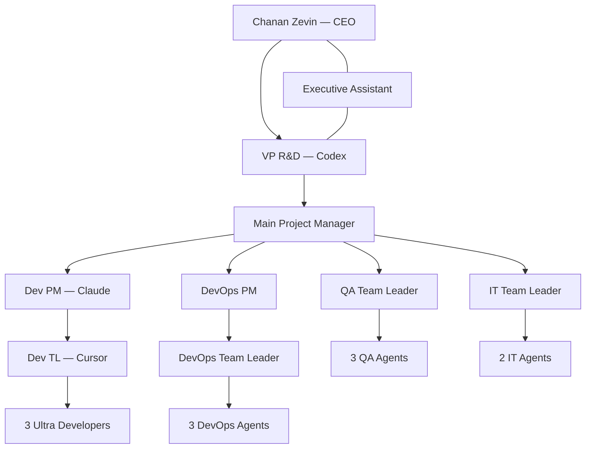
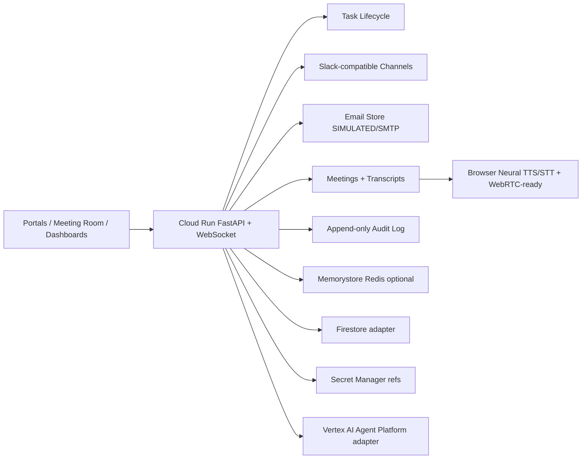

# Architecture — AI Capital Enterprise Team

```mermaid
flowchart TD
  CEO["Chanan Zevin — CEO"]
  EA["Executive Assistant"]
  VP["VP R&D — Codex"]
  PM["Main Project Manager"]
  DPM["Dev PM — Claude"]
  OPM["DevOps PM"]
  DEVTL["Dev TL — Cursor"]
  QATL["QA Team Leader"]
  OPTL["DevOps Team Leader"]
  ITTL["IT Team Leader"]
  DEV["3 Ultra Developers"]
  QA["3 QA Agents"]
  OPS["3 DevOps Agents"]
  IT["2 IT Agents"]

  CEO --- EA
  CEO --> VP
  EA --- VP
  VP --> PM
  PM --> DPM
  PM --> OPM
  PM --> QATL
  PM --> ITTL
  DPM --> DEVTL
  DEVTL --> DEV
  OPM --> OPTL
  OPTL --> OPS
  QATL --> QA
  ITTL --> IT
```

```mermaid
flowchart LR
  UI["Portals / Meeting Room / Dashboards"] --> API["Cloud Run FastAPI + WebSocket"]
  API --> Tasks["Task Lifecycle"]
  API --> Msg["Slack-compatible Channels"]
  API --> Mail["Email Store SIMULATED/SMTP"]
  API --> Meet["Meetings + Transcripts"]
  API --> Audit["Append-only Audit Log"]
  API --> Redis["Memorystore Redis optional"]
  API --> FS["Firestore adapter"]
  API --> SM["Secret Manager refs"]
  Meet --> Voice["Browser Neural TTS/STT + WebRTC-ready"]
  API --> Vertex["Vertex AI Agent Platform adapter"]
```

Target GCP project: `gen-lang-client-0386540117`.
